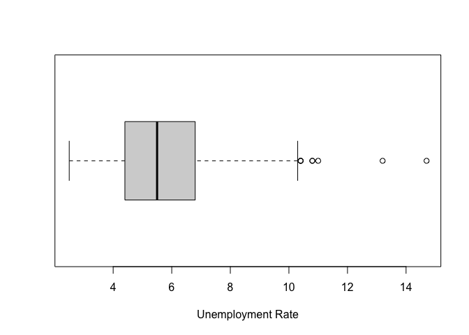

Exploratory Data Analysis of the Unemployment Rate of the United States
Labor Force
================
Corey Michaud
2023-03-16

# About the Data

This dataset, UNRATE.csv, was taken from
[FRED](https://fred.stlouisfed.org/series/UNRATE) and captures the
unemployment rate, as a percentage, of the United States labor force
from January 1, 1948 to February 1, 2023. The labor force data is
restricted to people 16 years of age and older who currently reside in
one of the 50 states or the District of Columbia. These people do not
reside in institutions or are on active duty in the Armed Forces.

# Libraries Used

``` r
library(tidyverse)
```

    ## ── Attaching core tidyverse packages ──────────────────────── tidyverse 2.0.0 ──
    ## ✔ dplyr     1.1.0     ✔ readr     2.1.4
    ## ✔ forcats   1.0.0     ✔ stringr   1.5.0
    ## ✔ ggplot2   3.4.1     ✔ tibble    3.2.0
    ## ✔ lubridate 1.9.2     ✔ tidyr     1.3.0
    ## ✔ purrr     1.0.1     
    ## ── Conflicts ────────────────────────────────────────── tidyverse_conflicts() ──
    ## ✖ dplyr::filter() masks stats::filter()
    ## ✖ dplyr::lag()    masks stats::lag()
    ## ℹ Use the conflicted package (<http://conflicted.r-lib.org/>) to force all conflicts to become errors

``` r
library(lubridate)
library(ggplot2)
library(tseries)
```

    ## Registered S3 method overwritten by 'quantmod':
    ##   method            from
    ##   as.zoo.data.frame zoo

``` r
library(psych)
```

    ## 
    ## Attaching package: 'psych'
    ## 
    ## The following objects are masked from 'package:ggplot2':
    ## 
    ##     %+%, alpha

# Looking at the Raw Data

``` r
unrate <- read.csv("UNRATE.csv", header = T)
head(unrate)
```

    ##         DATE UNRATE
    ## 1 1948-01-01    3.4
    ## 2 1948-02-01    3.8
    ## 3 1948-03-01    4.0
    ## 4 1948-04-01    3.9
    ## 5 1948-05-01    3.5
    ## 6 1948-06-01    3.6

This raw data consists of only 2 variables: the date (DATE) represented
by year-day-month, and the unemployment rate (UNRATE) represented by
percentage.

# Any Missing Values?

``` r
sum(is.na(unrate))
```

    ## [1] 0

Nope!

# Describing the Data

``` r
describe(unrate$UNRATE)
```

    ##    vars   n mean  sd median trimmed  mad min  max range skew kurtosis   se
    ## X1    1 902 5.73 1.7    5.5    5.59 1.63 2.5 14.7  12.2 0.84     1.03 0.06

Using the psych package, we can see the mean and median of our data is
5.73 and 5.5, respectively. The mean is greater than the median, so the
unemployment rate is skewed by 0.83, which isn’t that bad. The minimum
percentage of unemployment was 2.5 (woo!) but the highest percentage of
unemployment is 14.7.

# Transforming to Time Series

``` r
unrate$DATE <- ymd(unrate$DATE)
urts <- ts(unrate$UNRATE, start = c(1948,1), frequency = 12) # URTS = Unemployment Rate Time Series
head(urts, 24) # Head of first 2 years
```

    ##  [1] 3.4 3.8 4.0 3.9 3.5 3.6 3.6 3.9 3.8 3.7 3.8 4.0 4.3 4.7 5.0 5.3 6.1 6.2 6.7
    ## [20] 6.8 6.6 7.9 6.4 6.6

Now the data is better organized by months and years, as well as now
being a time series.

# Plotting Preview

``` r
#autoplot(urts) +
  #labs(x = "Date (Years)", y = "Percentage", main = "h") +
  #ggtitle("Unemployment Rate") + theme(plot.title = element_text(hjust = 0.5))
```

We can see there is a massive outlier at the year 2020. It is shown that
every few years the unemployment rate dips or peaks at different times,
which we will be exploring a little bit later.

# Stationarity

We will be using the the Augmented Dickey-Fuller test to see if this
time series data is stationary.

``` r
adf.test(urts)
```

    ## 
    ##  Augmented Dickey-Fuller Test
    ## 
    ## data:  urts
    ## Dickey-Fuller = -3.9119, Lag order = 9, p-value = 0.0134
    ## alternative hypothesis: stationary

We can see from the output that the p-value is 0.0134, so testing at the
alpha = 0.05 significance level we can see that the p-value is
significant, indicating the data is stationary.

# Data Visualization

``` r
boxplot(urts, horizontal = T, xlab = "Unemployment Rate")
```

<!-- -->
